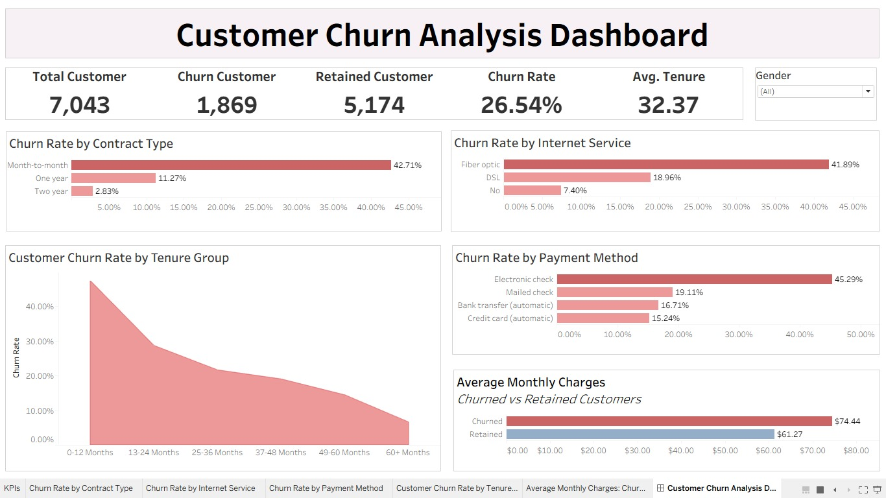

# Customer Churn Analysis

## Project Overview

This project analyzes the Telco Customer Churn dataset using SQL and Tableau to identify the key factors associated with customer churn. The analysis provides data-driven insights and business recommendations to support customer retention strategies through an interactive dashboard.

---

## Business Questions

1. Which contract type has the highest churn rate?
2. Which internet service has the highest churn rate?
3. Which payment method has the highest churn rate?
4. How does churn rate vary across tenure groups?
5. How do monthly charges differ between churned and retained customers?

---

## Tools

- SQL
- Tableau

---

## Dataset

- Total Records: 7,043
- Total Columns: 21
- Dataset: Telco Customer Churn
- Source: Kaggle

---

## Dashboard Preview

---

## Tableau Public Dashboard

🔗 **Dashboard Link:** https://public.tableau.com/app/profile/alya.izdihar4832/viz/CustomerChurnAnalysisDashboard_17860003714350/CustomerChurnAnalysisDashboard 

---

## Key Insights

- The overall customer churn rate was **26.54%**, with **1,869** customers leaving the company.
- Customers with **Month-to-month** contracts had the highest churn rate.
- Customers using **Fiber Optic** internet service experienced the highest churn rate.
- Customers using **Electronic Check** showed the highest churn rate among all payment methods.
- Customers within their first **12 months** of subscription had the highest churn rate.
- Customers who churned had higher average monthly charges than retained customers.

---

## Business Recommendations
- Customers with Month-to-month contracts have the highest churn rate. Encourage customers to switch to one-year or two-year contracts by offering discounts, loyalty programs, or exclusive promotions.
- Customers using Fiber Optic internet service have the highest churn rate. Evaluate service quality, network performance, pricing, and customer support to improve customer satisfaction and reduce churn.
- Customers using Electronic Check have the highest churn rate. Encourage customers to adopt automatic payment methods, such as credit cards or bank transfers, by offering cashback, discounts, or reward points.
- Customers within their first 0–12 months of subscription have the highest churn rate. Strengthen the onboarding process by providing clear service guides, maintaining regular communication, and monitoring customer satisfaction during the first year.
- Customers who churn have higher average Monthly Charges than retained customers. Review pricing strategies by offering personalized plans, bundled services, or targeted promotions to improve customer retention.

---

## Repository Contents

| File | Description |
|------|-------------|
| `README.md` | Project documentation and summary |
| `customer churn analysis.sql` | SQL queries used for data cleaning and business analysis |
| `customer churn dashboard.twb` | Tableau workbook |
| `dashboard.png` | Dashboard preview image |
